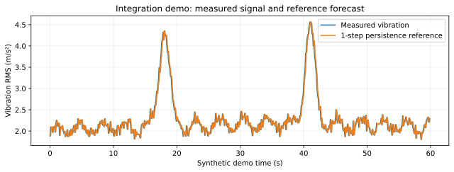
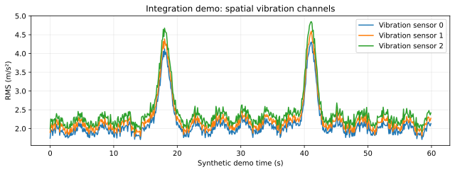
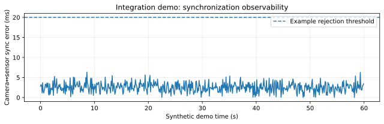
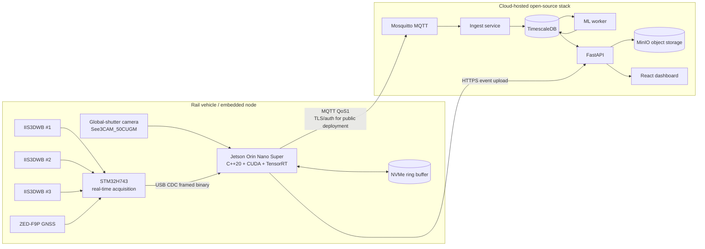
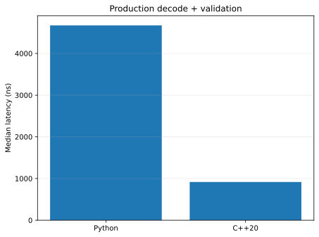
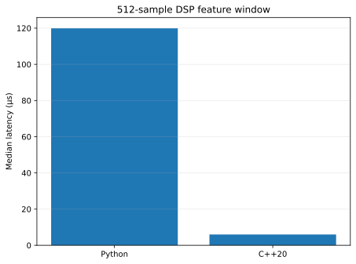

# RailGuard-MM

**RailGuard Multimodal Monitoring — a predictive edge-AI platform for railway condition monitoring.**

The name **RailGuard-MM** combines **RailGuard** (railway condition and infrastructure monitoring) with **MM** (**Multimodal**), reflecting the synchronized fusion of machine vision, multi-point vibration, GNSS, environmental context, and time-series modeling used throughout the system.

**Predicting railway condition from what a vehicle sees, feels, and where it is.**

RailGuard-MM is a portfolio-grade autonomous sensing system that turns synchronized **machine vision + multi-point vibration + GNSS + environment** into future-condition forecasts, anomaly evidence, and an online time-series view. The engineering goal is not to demonstrate isolated technologies; it is to answer whether multimodal sensing provides enough additional information to justify the complexity of deploying it on an embedded railway inspection node.

## The value proposition

A rail vehicle can experience a dynamic response before a surface condition is visually obvious, while a camera can localize and explain conditions that vibration alone cannot. RailGuard-MM combines those complementary signals and asks three falsifiable questions:

1. **Predictive value —** does an independently trained multimodal model forecast future vibration/visual behavior better than persistence, classical ML, sensor-only DL, and vision-only DL?
2. **Generalization —** does that advantage survive untouched railway geography, repeated training seeds, camera timing error, and dropped frames?
3. **Deployment value —** can deterministic acquisition, native C++ processing, durable edge/cloud delivery and TensorRT deployment support the model without hiding timing or reliability failures?

Those questions define the repository structure and the experiment program in [docs/experiments.md](docs/experiments.md).

## Evidence available now

| Claim / evaluation target | Evidence in this repository | Status |
|---|---|---|
| Native edge processing materially reduces deterministic preprocessing cost | **5.10×** faster production decode + semantic/timestamp validation and **20.06×** faster matched 512-sample DSP than the Python reference on the recorded x86-64 host benchmark | **Measured** |
| Edge telemetry is retained until application-level database persistence is acknowledged | SQLite outbox + QoS 1 + post-TimescaleDB application ACK + idempotent `(device_id, ts, seq)` identity + optional HMAC ACK | **Host verified; composed CI gate defined** |
| Multimodal training/evaluation is protected against repeated-route leakage | 500 m spatial blocks, 30 m purge margin, split-aware temporal features, untouched geography, image-byte provenance | **Implemented + tested** |
| The camera/data contract matches the deployed monochrome sensor | Y12/GREY native path + `monochrome_replicated_rgb` training contract | **Implemented + tested** |
| Does multimodal fusion improve prediction on unseen track geography? | Matched-seed independent-model evaluator + held-out-group bootstrap | **Experiment ready; result intentionally pending** |
| Does TensorRT improve the target Jetson latency/power trade-off without unacceptable accuracy loss? | FP32/FP16/INT8 build and benchmark path | **Requires target Jetson measurement** |
| Can the three-sensor physical node sustain acquisition without FIFO/DMA timing failures? | C17 HAL path + host tests + electrical design | **Requires assembled hardware** |

The repository deliberately keeps **measured**, **host-verified**, **implemented**, and **hardware-required** claims separate. See [docs/verification.md](docs/verification.md).

## What the system looks like in motion

The plots below are generated from the deterministic integration stream and exist to show the dashboard/time-series behavior. They are **synthetic integration-demo data, not ML accuracy evidence**.

<p align="center">
  
</p>

<p align="center">
  
  
</p>

## Open data used for real experiments

The project uses a deliberately small, role-specific open-data catalog rather than collecting arbitrary datasets.

| Source | License | Role in the project |
|---|---|---|
| **Rail-VIVID** — SALUS Lab / CMU, DOI `10.57967/hf/8411` | **CC BY 4.0** | Primary multimodal benchmark: six vibration channels, global-shutter images, GPS/environment, repeated runs, documented anomalies |
| **Railway Track Surface Faults Dataset** — DOI `10.17632/8hxtgyyxrw.2` | **CC BY 4.0** | Auxiliary seven-class rail-surface vision task used to test whether railway-specific encoder pretraining improves Rail-VIVID generalization |

The second dataset is never mixed into Rail-VIVID time-series labels. Its classification score is secondary because the source contains video-extracted frames; the portfolio-relevant test is whether the pretrained encoder improves the **same untouched Rail-VIVID spatial test**. Data acquisition and provenance: [docs/data.md](docs/data.md) and [`data/open_sources.yaml`](data/open_sources.yaml).

## The experiment that should become the headline result

After preparing the public Rail-VIVID runs, the showcase suite trains independent models across matched seeds and generates the comparison/robustness artifacts in one command:

```bash
python ml/run_showcase_experiments.py \
  data/processed/rail_vivid_multirun.csv \
  --seeds 7,17,37 \
  --epochs 10 \
  --out artifacts/showcase
```

The result to publish is not “the Transformer trained successfully.” It is this controlled comparison:

| Model | Vib MAE +1 | +5 | +10 | Vision MAE +1 | +5 | +10 |
|---|---:|---:|---:|---:|---:|---:|
| Persistence | generated | generated | generated | generated | generated | generated |
| Random Forest | generated | generated | generated | n/a | n/a | n/a |
| Sensor-only DL | generated | generated | generated | generated | generated | generated |
| Vision-only DL | generated | generated | generated | generated | generated | generated |
| **Multimodal DL** | **generated** | **generated** | **generated** | **generated** | **generated** | **generated** |

For every neural comparison the code requires the same dataset fingerprint, feature/image contract, split, purge margin, untouched test geography, timebase and training seed. The per-seed report bootstraps whole held-out geographic groups, and the repeated-seed summary reports mean/SD plus wins/ties/losses rather than presenting one favorable training run.

## Project goals

1. Build a synchronized embedded sensing platform that combines machine vision, vibration, position and operating context.
2. Forecast future physical behavior rather than only classify past faults.
3. Quantify when multimodal fusion helps and when timing/dropout makes it fail.
4. Preserve deterministic acquisition at the MCU and move latency-critical edge processing into C++20/CUDA/TensorRT.
5. Preserve measurement identity and durability from edge acquisition through time-series persistence.
6. Keep every public-data and model artifact reproducible through immutable revisions, SHA-256 lineage and explicit licenses.

## Why this is a useful autonomous-systems showcase

The project demonstrates the full chain a real sensing product has to get right: **sensor electronics → timing → data acquisition → native perception → temporal ML → deployment artifact lineage → unreliable-network handling → time-series persistence → browser observability**. It also makes the failure modes visible instead of treating them as implementation details: clock lock, camera matching, inter-sensor skew, missing context, packet loss, spool depth and prediction residuals are all first-class telemetry.

# System architecture



## Hardware selection

| Element | Selected part | Why it was chosen |
|---|---|---|
| Edge AI computer | **NVIDIA Jetson Orin Nano Super 8 GB** | High edge-AI density, CUDA/TensorRT ecosystem, hardware video/vision acceleration and enough compute for CNN/ViT plus temporal fusion. NVIDIA specifies up to 67 INT8 TOPS and 7-25 W operation. |
| Real-time acquisition MCU | **STM32H743** | 480 MHz Cortex-M7 with DSP/FPU, large SRAM, fast SPI/USB and deterministic timing. It isolates high-rate acquisition from Linux scheduling jitter. |
| Vibration sensors | **3 x ST IIS3DWB** | Industrial 3-axis digital vibration sensors with a flat wide bandwidth, 26.7 kHz ODR, FIFO, low noise and selectable ±2/4/8/16 g ranges. Three mounting locations allow spatial dynamic signatures. |
| Machine-vision camera | **e-con Systems See3CAM_50CUGM** | 5 MP monochrome Sony Pregius IMX264 global shutter, USB 3, Linux UVC/V4L2 and external trigger. The same camera family is documented in Rail-VIVID, reducing dataset-to-hardware mismatch. |
| Position/time | **u-blox ZED-F9P** | Multi-band GNSS/RTK capability for spatial indexing and a PPS timing reference. Position context is important when correlating repeat passes over the same defect. |
| Local storage | **256 GB NVMe** | Provides capacity for event-frame retry cache, model artifacts and optional raw-signal capture without putting large objects on the scalar telemetry path. |
| Main DC/DC | **MEAN WELL RSDW60F-12, 9-36 V -> 12 V / 5 A** | 60 W railway-oriented isolated DC/DC module with wide 24 V-class input range. It cleanly powers the Jetson developer-kit DC input while leaving substantial margin. |
| Sensor-board regulator | **TPS62130-class 12 V -> 3.3 V / 3 A buck** | Dedicated logic/sensor rail keeps acquisition electronics independent of USB peripheral loading. |

Full hardware design: [docs/hardware.md](docs/hardware.md)  
BOM: [hardware/bom.md](hardware/bom.md)  
Pin map: [hardware/pinmap.md](hardware/pinmap.md)  
Electrical design: [hardware/electrical_design.md](hardware/electrical_design.md)  
Netlist: [hardware/netlist.csv](hardware/netlist.csv)  
Connectors/harness: [hardware/connectors.md](hardware/connectors.md)  
Power budget: [hardware/power_budget.md](hardware/power_budget.md)

## Data path

1. **STM32 acquisition** samples the IIS3DWB devices through independent chip-selects, captures GNSS/PPS timing and creates CRC-protected binary packets.
2. **Jetson native runtime** uses C++20 to decode PPS-stamped packets, capture V4L2 camera frames, build synchronized temporal windows, compute native DSP/vision features and execute the optional TensorRT model. The existing higher-level telemetry publisher remains the network boundary and durable outbox, so acquisition/inference latency is isolated from cloud connectivity.
3. **Cloud ingestor** validates MQTT scalar telemetry and writes it into TimescaleDB.
4. **Event upload path** caches anomaly-triggered JPEG frames locally, retries failed uploads, and stores accepted artifacts through FastAPI into MinIO.
5. **ML worker** consumes recent windows, runs forecasting/anomaly inference, and writes future estimates back to the time-series database.
6. **FastAPI** exposes measured/predicted values and event artifacts through a versioned REST API.
7. **React dashboard** fetches the API and renders measured/predicted vibration RMS, vision motion score, anomaly probability, speed and environment over time.

## ML/DL design

RailGuard-MM intentionally contains three modeling levels so the repository shows model maturity rather than a single opaque network.

### 1. Classical ML baseline

`ml/train_classical.py`

- rolling RMS / peak / kurtosis / crest factor;
- band energy and spectral centroid;
- visual motion / blur / intensity statistics;
- speed, temperature and humidity context;
- lagged features and deltas;
- `RandomForestRegressor` for next-window vibration prediction;
- `IsolationForest` for unsupervised anomaly score.

This baseline is fast to train, interpretable through feature importance and useful for proving that the multimodal signal contains predictive information before using a larger network.

### 2. Deep temporal model

`ml/railguard_ml/models.py`

- compact CNN frame encoder;
- vibration/context projection network;
- learned modality tokens;
- Transformer encoder across synchronized time steps;
- multi-task heads for next-horizon vibration forecast, future visual-motion forecast and anomaly probability.

### 3. Multimodal temporal fusion

The fusion model treats each timestamp as a synchronized tuple:

```text
x_t = {image_t, vibration_features_t, speed_t, temperature_t, humidity_t}
```

Latitude/longitude are deliberately excluded from the deployment feature vector. They are used for spatial splitting, visualization and anomaly association so the network cannot improve its test score by memorizing coordinates.

A sequence of these tuples is encoded over time. The model therefore learns both cross-modal relationships at a timestamp and temporal evolution across the sequence. Forecast error can also act as an anomaly signal: when measured future behavior diverges strongly from the learned prediction, the residual increases.

Detailed model design: [docs/ml.md](docs/ml.md)

### Export and deploy the deep model

Python/PyTorch is the research and training environment; the optimized deployment boundary is ONNX/TensorRT:

```bash
python ml/combine_runs.py data/processed/*.csv --out data/processed/rail_vivid_multirun.csv
python ml/train_multimodal.py data/processed/rail_vivid_multirun.csv --epochs 10 --modality multimodal --seed 17
# Train sensor_only and vision_only with the same split/seed for the controlled comparison.
python ml/export_onnx.py models/fusion_transformer.pt --out models/fusion_transformer.onnx
./deploy/tensorrt/build_engine.sh models/fusion_transformer.onnx models/fusion_transformer_fp16.engine
```

The ONNX wrapper embeds the training-set sensor normalization constants. Training fingerprints both the processed structured table **and every referenced training image byte**, so changing an image cannot preserve the same dataset identity merely because the CSV is unchanged. Export writes a SHA-256 lineage manifest containing that provenance, checkpoint hash, ONNX hash, ordered feature contract, model timebase and train/validation/test split metadata. The TensorRT builder fails closed without the checkpoint-derived ONNX manifest, verifies the ONNX bytes, and extends the lineage with the engine hash. The C++ runtime therefore consumes physical-unit telemetry and returns +1/+5/+10-step vibration/vision forecasts plus anomaly probability only when an explicit trained engine is supplied. TensorRT uses named tensors and a dynamic temporal profile (`T=4..128`, optimized at 32).

Native build:

```bash
cmake -S edge/cpp -B build/edge-cpp -DCMAKE_BUILD_TYPE=Release
cmake --build build/edge-cpp -j
ctest --test-dir build/edge-cpp --output-on-failure
```

Jetson CUDA/TensorRT build:

```bash
cmake -S edge/cpp -B build/edge-jetson -DCMAKE_BUILD_TYPE=Release \
  -DRAILGUARD_ENABLE_CUDA=ON -DRAILGUARD_ENABLE_TENSORRT=ON
cmake --build build/edge-jetson -j$(nproc)
```

See [deploy/tensorrt/README.md](deploy/tensorrt/README.md) and [docs/performance.md](docs/performance.md).

## Dashboard

The dashboard is designed around engineering observability rather than a generic KPI page. It displays:

- measured vibration RMS and predicted vibration RMS on the same time axis;
- prediction horizon and residual;
- measured visual motion score and its forecast;
- anomaly probability;
- speed, temperature and humidity;
- device health, packet-loss count and durable-spool depth/drop count;
- camera↔sensor synchronization error and clock-alignment quality;
- three spatial vibration RMS channels and operating-context validity.

The browser only talks to the FastAPI service; it never receives database credentials.

## Repository layout

```text
railguard-mm/
├── firmware/          C17 STM32 FIFO/DMA/PPS acquisition + bench target
├── edge/              C++20 native Jetson runtime + Python telemetry/reference path
├── ml/                open-data tooling, visual pretraining, baselines and multimodal models
├── cloud/             MQTT ingestor, TimescaleDB schema, inference worker and API
├── web/               React/Vite time-series dashboard
├── hardware/          BOM, power tree, pin map and design notes
├── docs/              architecture, experiments, verification, hardware, ML and data rationale
├── deploy/            reverse proxy + ONNX/TensorRT build/benchmark scripts
├── data/              machine-readable open-source dataset registry (raw data ignored)
├── schemas/           telemetry JSON schema
├── tests/             protocol/model/feature unit tests
└── docker-compose.yml end-to-end cloud stack
```

## Quick start

### 1. Python environment

```bash
python -m venv .venv
source .venv/bin/activate
pip install -r requirements-dev.txt
```

### 2. Generate a small synchronized demo stream

```bash
python scripts/generate_demo_data.py --out data/sample/telemetry.jsonl --minutes 5
```

### 3. Start the cloud stack

```bash
cp .env.example .env
docker compose up --build
```

Services:

- dashboard: `http://localhost:8080`
- API docs: `http://localhost:8000/docs`
- MQTT: `localhost:1883`
- TimescaleDB: `localhost:5432`
- MinIO console: `http://localhost:9001`

### 4. Replay the edge stream

```bash
pip install -r edge/requirements.txt
python -m edge.railguard_edge.main \
  --config edge/config.example.yaml \
  --replay data/sample/telemetry.jsonl
```

For the optimized hardware path, build the native runtime and connect the STM32 and camera directly:

```bash
make native
./build/edge-cpp/railguard_edge \
  --serial /dev/ttyACM0 \
  --camera /dev/video0 \
  --seq-len 32 | \
python -m edge.railguard_edge.native_bridge --config edge/config.example.yaml
```

On Jetson, launch the engine through the manifest-verifying wrapper so the runtime cannot silently publish results from a tampered or unidentified engine:

```bash
deploy/tensorrt/run_edge_verified.sh models/fusion_transformer_fp16.engine \
  --serial /dev/ttyACM0 --camera /dev/video0
```

The wrapper verifies the TensorRT engine SHA-256 and checkpoint lineage, validates the ordered feature and monochrome image contracts, and takes `model_version`, sequence length and model timebase from the signed-by-hash deployment manifest rather than from operator defaults. Those manifest-controlled arguments cannot be overridden at launch. The C++ process owns serial decoding, format-aware V4L2 mmap capture, temporal window construction and inference, and emits the same telemetry JSON contract used by the cloud path. `native_bridge.py` adds the durable SQLite producer/consumer boundary and handles MQTT/network retry so broker latency cannot directly block acquisition.

### 5. Acquire open experiment data

List the approved experiment sources and their licenses/roles:

```bash
pip install -r ml/requirements.txt
python ml/open_data.py list
```

Acquire a selected Rail-VIVID run/path pattern. The tool resolves the source revision to an immutable commit and hashes every selected file:

```bash
python ml/open_data.py acquire rail_vivid \
  --pattern 'AtoB_*/*' \
  --dest data/rail_vivid
```

The complete dataset is large, so acquisition is deliberately pattern-based. The preprocessing adapter converts °F→°C, normalizes timestamps before image matching, preserves all six public accelerometer-channel RMS values, emits frame-alignment QA, resets split-sensitive temporal features at partition boundaries, and supports the spatial block + purge split used by the headline benchmark.

For the optional auxiliary rail-surface vision experiment, download Version 2 of the CC BY 4.0 Railway Track Surface Faults Dataset from its provider and fingerprint/import it with:

```bash
python ml/open_data.py import-surface-faults /path/to/provider/download \
  --dest data/rail_surface_faults

python ml/train_visual_faults.py /path/to/provider/download \
  --out models/rail_surface_frame_encoder.pt
```

See [docs/data.md](docs/data.md) for acquisition/provenance rules and [docs/experiments.md](docs/experiments.md) for the experiment hierarchy.

## Telemetry contract

Scalar telemetry is intentionally compact. Raw high-rate samples and full images are not pushed in every MQTT message.

```json
{
  "schema_version": 1,
  "device_id": "railguard-001",
  "ts": "2026-08-20T14:05:12.125Z",
  "seq": 9124,
  "sample_period_ms": 100.0,
  "gps": {"lat": 40.2351, "lon": -77.8853, "speed_mps": 6.2},
  "environment": {"temperature_c": 24.3, "humidity": 0.58},
  "vibration": {
    "rms_ms2": 2.81,
    "peak_ms2": 8.91,
    "kurtosis": 3.42,
    "crest_factor": 3.17,
    "band_energy": [0.11, 0.26, 0.41, 0.22],
    "sensors": [
      {"sensor_id": 0, "rms_ms2": 2.54},
      {"sensor_id": 1, "rms_ms2": 2.81},
      {"sensor_id": 2, "rms_ms2": 3.02}
    ]
  },
  "vision": {"motion_score": 0.21, "contrast": 0.68, "sharpness": 1.17, "frame_ref": null},
  "health": {
    "packet_loss": 0, "spool_depth": 0, "spool_dropped": 0,
    "camera_matched": true, "sync_error_ms": 3.4, "sensor_skew_ms": 1.8,
    "clock_alignment_locked": true, "clock_jitter_ms": 1.2, "clock_samples": 32,
    "context_flags": 3
  }
}
```

Predictions are persisted separately with their forecast target timestamp, which prevents accidental leakage between the time the prediction was made and the time being predicted.

## Engineering choices and trade-offs

### Why not connect the vibration sensor directly to Linux?

Linux is excellent for perception and networking but is not a hard real-time acquisition environment. The STM32 provides deterministic SPI servicing, FIFO draining and timestamping. The Jetson can restart or experience compute bursts without losing the exact sensor timing model.

### Why global shutter?

A rail-facing camera sees fast relative motion and vibration. Rolling shutter can convert motion into geometric skew, which directly contaminates machine-vision features. A global shutter captures the frame simultaneously and therefore provides a cleaner spatial observation.

### Why publish features instead of raw data continuously?

At 26.7 kHz, three triaxial sensors can create a much larger stream than is useful for a dashboard. The reference MCU sends compact analysis windows while the cloud channel stays bounded; the protocol can be extended with a raw-window packet type when a hardware campaign requires local high-rate capture. Anomaly-triggered image artifacts already use the separate object-upload path.

### Why TimescaleDB?

The data model is relational but dominated by time-window queries, downsampling and joins between measured and predicted values. TimescaleDB preserves SQL while adding hypertables and time-series operations.

### Why MQTT?

MQTT is lightweight, mature, supports QoS and is a natural boundary between intermittently connected edge nodes and cloud consumers. RailGuard does **not** treat broker PUBACK as end-to-end delivery: the edge first commits telemetry to its SQLite outbox, publishes at QoS 1, and retains the row until the ingestor has successfully persisted the idempotent TimescaleDB upsert and publishes an application ACK keyed by `(device_id, timestamp, sequence)`. The reference configuration HMAC-signs that ACK; production deployments must replace the development key and additionally enforce broker TLS/authentication/ACLs. A lost ACK causes safe re-delivery rather than silent deletion. This is an at-least-once application protocol, not a claim of globally exactly-once delivery.

### Why MinIO?

Images, raw windows and model artifacts are object data rather than relational rows. MinIO provides an S3-compatible interface while keeping the stack self-hostable and portable.

### Why FastAPI + React?

FastAPI gives typed API contracts, automatic OpenAPI documentation and straightforward Python integration with the ML/cloud stack. React keeps the browser decoupled from storage and makes the dashboard easy to extend with route maps, event review and device fleets.

## Native optimization and measured results

The latency-critical edge path is implemented in **C++20**, with a dependency-free CPU build for CI and optional **CUDA C++ / TensorRT** for Jetson. The STM32 hardware path is **C17** and uses FIFO watermark interrupts, burst SPI DMA and PPS-disciplined timestamps. The selected See3CAM_50CUGM is monochrome/Y12; the native camera preprocessor explicitly supports negotiated Y12 stride/padding instead of assuming a YUYV color stream.

A local CPU microbenchmark on an x86_64 Intel Xeon Platinum 8573C validation host produced:

<!-- BENCHMARK_TABLE_START -->
| Operation | Python reference | C++20 native | Improvement |
|---|---:|---:|---:|
| Legacy CRC packet decode | 1173 ns | 455 ns | **2.58x** |
| 94-byte production packet decode | 1948 ns | 915 ns | **2.13x** |
| 94-byte production throughput | 0.513 Mpacket/s | 1.093 Mpacket/s | **2.13x** |
| Production decode + semantic/timestamp validation | 4672 ns | 916 ns | **5.10x** |
| Validated production throughput | 0.214 Mpacket/s | 1.092 Mpacket/s | **5.10x** |
| 512-sample DSP window | 119.90 us | 5.98 us | **20.06x** |
<!-- BENCHMARK_TABLE_END -->

<p align="center">
  
  
</p>

These are reproducible microbenchmarks, not Jetson GPU claims. CUDA/TensorRT was not available in that host environment, so the repository deliberately provides `trtexec` scripts and an evaluation protocol rather than publishing fabricated FPS numbers. Detailed methodology and caveats: [docs/performance.md](docs/performance.md).

Commands:

```bash
make native-test
make firmware-host-test
make benchmark
```

For a deliberately skeptical claim-by-claim review, see [docs/adversarial_review.md](docs/adversarial_review.md) and the [verification matrix](docs/verification.md).

## Validation targets

The repository is structured around measurable engineering questions:

- Does multimodal forecasting reduce vibration MAE relative to a vibration-only baseline?
- Does adding vision reduce false positives at benign high-vibration locations?
- Does adding speed/environment context improve generalization between repeated runs?
- How much accuracy is lost when the frame encoder is quantized for edge deployment?
- What prediction horizon gives enough maintenance value without excessive uncertainty?
- How does time-alignment error affect multimodal performance?

## Safety and scope

This repository is an engineering reference for multimodal condition-monitoring research and system development. Railway inspection systems intended for operational safety decisions require domain-specific validation, environmental qualification, calibration, fault-tolerance analysis and compliance with the applicable rail standards before field use.

## License

Code: MIT. See [LICENSE](LICENSE).

Dataset attribution: Rail-VIVID is provided by its authors under CC BY 4.0. Cite the dataset and associated publication when using it.
