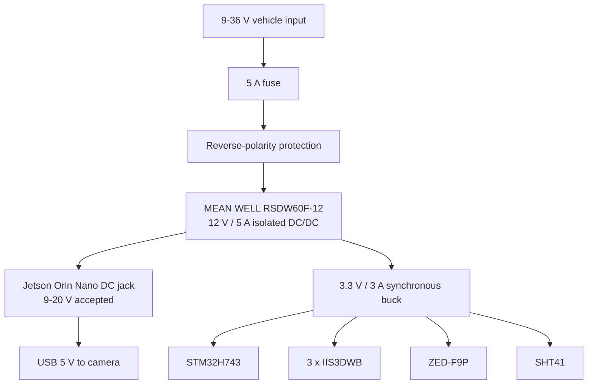

# Hardware design

## 1. Design goals

The electronics are partitioned so high-rate sensor capture remains deterministic even when the AI computer is heavily loaded. The reference node assumes a nominal 24 V vehicle supply and separates high-current compute power from low-noise acquisition power.

## 2. Compute partition

### Jetson Orin Nano Super

Responsibilities:

- V4L2 camera capture;
- image preprocessing and CNN inference;
- cross-modal alignment;
- optional TensorRT model execution;
- local NVMe buffering;
- MQTT/TLS and object uploads;
- device health monitoring.

The developer-kit carrier accepts a 9-20 V DC-jack input and is therefore powered from the 12 V system rail. The production migration path is an Orin Nano production module plus a custom carrier using NVIDIA's design guidance.

### STM32H743

Responsibilities:

- three SPI vibration devices;
- GNSS UART and PPS capture;
- precise sample/window timestamping;
- CRC-framed USB stream to Jetson;
- watchdog and sensor self-test;
- deterministic handling of FIFO watermarks.

## 3. Vibration front end

Three IIS3DWB devices are mounted at different structural locations. Each device is configured for ±16 g during initial commissioning; lower full-scale ranges can be used after measuring the actual dynamic envelope.

Per sensor:

- 3.3 V digital supply;
- 100 nF + 1 µF local decoupling placed next to the device;
- shared SPI SCK/MISO/MOSI with one dedicated chip-select per sensor;
- 10 kΩ pull-up on each chip-select to prevent accidental selection during MCU reset;
- INT1 routed to a separate MCU EXTI input;
- short rigid mechanical path from sensor package to monitored structure;
- sensor axes documented in enclosure coordinates.

The IIS3DWB runs at its fixed high output data rate. MCU firmware drains FIFO data with SPI/DMA, anti-alias filters/decimates as required, and constructs lower-rate analysis windows. The default model path uses 2 kHz-equivalent windows to remain close to Rail-VIVID while preserving optional higher-frequency raw data locally.

## 4. Camera

The See3CAM_50CUGM is connected directly to a Jetson USB 3 port. It exposes a standard Linux UVC/V4L2 device and uses a global-shutter Sony Pregius sensor.

Mounting requirements:

- rigid bracket isolated from cable strain;
- fixed focus after calibration;
- lens hood to reduce flare;
- exposure constrained to avoid motion blur;
- camera-to-track extrinsics stored in configuration;
- USB cable retention so vibration cannot partially unseat the connector.

The basic implementation timestamps frames at the Jetson capture boundary and aligns them to the PPS-disciplined sensor timeline. Hardware trigger can be added through the camera's trigger interface when the application requires tighter frame timing.

## 5. GNSS and time

A ZED-F9P module provides:

- UART navigation messages to STM32;
- 1 PPS to a timer-capture input;
- position and ground speed;
- optional RTK corrections.

The PPS signal is the common timing epoch. Position is stored as context and for repeat-pass indexing, but the primary ML benchmark does not feed raw latitude/longitude directly to the model because that can cause location memorization.

## 6. Environmental context

A Sensirion SHT41 provides measured ambient temperature and relative humidity over I2C1. The purpose is to preserve the environmental context available in Rail-VIVID and to distinguish vibration changes caused by operating/environmental conditions from structural changes.

The sensor uses a dedicated non-blocking firmware state machine: the command is transmitted using interrupt-driven I2C, the conversion interval is waited asynchronously, the six-byte response is read using interrupt-driven I2C, and both data words must pass CRC-8 before the context-valid flag is set. Temperature and humidity therefore cannot block the 26.667 kHz vibration FIFO service path.

Placement matters more than bus speed: the SHT41 is located at a ventilated PCB/enclosure edge and away from the Jetson exhaust and switching converters to reduce self-heating bias.

## 7. Power tree

The RSDW60F-12 is a 60 W module for a nominal 24 V system with a 9-36 V input range and 12 V / 5 A output. This avoids making the portfolio board's highest-risk element a custom high-current converter and makes the power architecture easier to review and reproduce.

The acquisition board uses a dedicated 3.3 V synchronous regulator. Place a ferrite-bead/LC branch between the main 3.3 V plane and each MEMS local decoupling island if switching noise appears in validation.

## 8. MCU minimum circuit

Recommended board-level implementation:

- every VDD pin: 100 nF X7R immediately adjacent;
- one 4.7-10 µF bulk capacitor per MCU supply region;
- VCAP1/VCAP2: 2.2 µF low-ESR capacitors as required by the STM32H7 reference design;
- NRST: 10 kΩ pull-up and 100 nF to ground, plus SWD reset access;
- BOOT0: 100 kΩ pull-down with test pad;
- 10-pin Cortex SWD header for SWDIO/SWCLK/NRST/3V3/GND;
- USB FS D+/D- routed as a 90 Ω differential pair with ESD protection at the connector;
- GNSS PPS routed to a timer input-capture pin with a short trace and optional small series damping resistor footprint;
- sensor SPI clock/MOSI include unpopulated 22-33 Ω series-resistor footprints for edge-rate tuning.

## 9. Grounding and EMC

- four-layer minimum PCB;
- Layer 2 as an uninterrupted ground reference plane;
- keep DC/DC switching current loops physically separated from the vibration sensors;
- do not route USB/SPI clocks under MEMS packages;
- place sensors near rigid mounting points, not near board edges that flex;
- use a chassis/functional-earth strategy at enclosure entry rather than creating multiple uncontrolled return paths;
- use locking connectors and strain relief for every cable in the vibration environment.

## 10. Watchdogs and fault handling

STM32:

- independent watchdog;
- sensor FIFO overrun counter;
- boot self-test and WHO_AM_I validation;
- CRC error counter;
- PPS-loss flag and free-running fallback clock.

Jetson:

- systemd watchdog for edge service;
- disk usage and NVMe health monitoring;
- camera reconnect loop;
- MQTT reconnect/backoff;
- local spool if cloud connectivity is unavailable.

## 11. Bring-up sequence

1. Validate RSDW 12 V output and polarity before connecting Jetson.
2. Validate 3.3 V rail, ripple and startup behavior under dummy load.
3. Verify STM32 SWD access and USB enumeration.
4. Read WHO_AM_I from each IIS3DWB independently.
5. Verify FIFO watermark interrupt rate and check for overrun at maximum acquisition rate.
6. Inject a known mechanical excitation and compare sensor axes/locations.
7. Verify GNSS PPS capture against decoded UTC.
8. Verify SHT41 CRC handling and compare temperature/humidity against a reference instrument away from board heat.
9. Connect camera and validate V4L2 capture at target exposure/frame rate.
10. Start edge service and verify monotonic timestamps/sequence counts.
11. Enable cloud publishing and compare local vs cloud timestamps.

See also [hardware/electrical_design.md](../hardware/electrical_design.md) for connector- and net-level detail.
